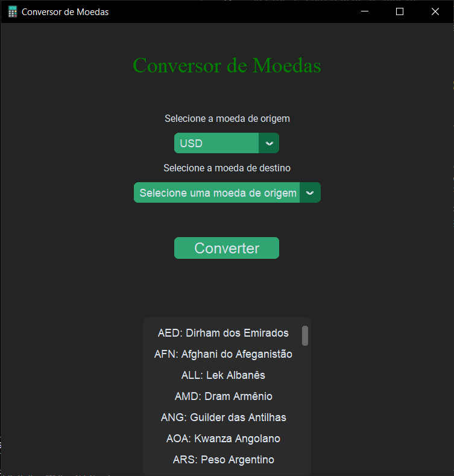

# Conversor de Moedas em Python:  
### 🚀 Iniciando...

Esse aplicativo é uma ferramenta permite que usuários convertam o valor de uma unidade monetária para outra com base nas taxas de câmbio atuais. Para que assim facilite a transação monetária em P2P (peer-to-peer), realizando uma cotação rápida e ágil aos steakholders (partes interessadas). 
## ⚙️Funcionalidades
### Dentre o conversor de moedas tem as seguintes funcionalidades:
- Converte valores entre diferentes tipos de moedas;
- Oferece acesso a taxas de câmbio; 
- Integra plataformas de comércio exterior;
- Configura conversão padrão do nosso sistema;
- Registra os históricos de taxas e compartilha o conhecimento preciso de diferentes valores de moedas em tempo real;

Em resumo, tais propriedades são essenciais para lidar com as complexidades das transações financeiras internacionais do comércio exterior.


## ⌨️ Processo de instalação:

- Customtkinter.
- Xmltodict.
- Requests. 

E para a instalação das bibliotecas pode-se utilizar:

```bash
pip install customtkinter xmltodict requests
```
    
## 🔧 Pré-requisitos
### Os pré-requisitos básicos para o funcionamento adequado do conversor de moedas incluem:
- Bibliotecas customtkinter: Biblioteca padrão do Python para a criação de interfaces gráficas;

- Xmltodict: Facilitação da conversão de documentos XML em estruturas de dados Python (dicionários);
- Requests: Estas bibliotecas geralmente são utilizadas para fazer requisições HTTP de maneira simples e com maior eficiência;

 Em geral são bibliotecas utilizadas para incorporar funcionalidades adicionais aos projetos de software.


 

## Screenshots

 


## 🖇️Aprendizados

Nós alunos aprendemos a aplicar diferentes bibliotecas no VisualStudioCode, simplificando códigos e aprendendo alguns em específicos, realizando uma dinâmica interação entre o VisualStudioCode e o site do GitHub. Também práticamos a alteração da interface gráfica de nosso conversor, criando e configurando janelas, descobrindo novos sites para a integração e aprimoramento de nosso projeto (exemplo dos códigos, API de importações). De maneira geral, isso contribuiu para nosso desenvolvimento dentro do curso técnico Desencolvimento de Sistemas.


## ✒️ Autores
### Grupo 08:
- Larissa, n°07
- Sara, n°16
- Eduardo, n°28
- Olivia, n°34
